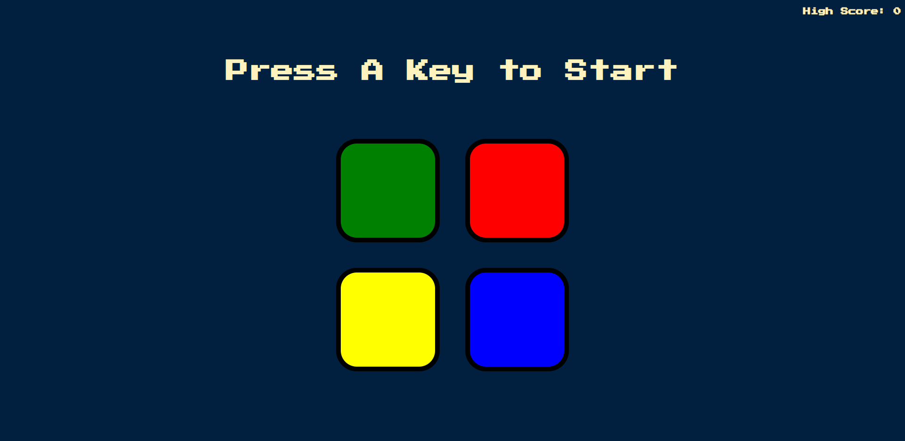

## Table of contents

- [Overview](#overview)
  - [The project](#the-project)
  - [Screenshot](#screenshot)
  - [Links](#links)
- [My process](#my-process)
  - [Built with](#built-with)
  - [What I learned](#what-i-learned)
  - [Continued development](#continued-development)

## Overview

### The challenge

- The aim of this project was to create a memory game that makes use of a colour sequence which increments by one each time and the user needs to follow this 
pattern correctly. 

### Screenshot



### Links

- Live Site URL: https://aidenm99.github.io/Simon-Game/

## My process

### Built with

- Semantic HTML5 markup
- CSS custom properties
- JavaScript
- jQuery

### What I learned

- Selecting elements with jQuery

```js
$(document)
```

- Adding animations with JavaScript

```js
$("#" + randomChosenColour).fadeOut(100).fadeIn(100).fadeOut(100).fadeIn(100);
```

- What logical NOT operators are

```js
var started = false;

$(document).keypress(function() {

  if (!started) {

    $("h1").text("Level " + level);

    nextSequence();

    started = true;
  }
});
```

- How to better utilise arrays and search inside of them

```js
var buttonColours = ["red", "blue", "green", "yellow"];
var randomNumber = Math.floor(Math.random() * 4);
var randomChosenColour = buttonColours[randomNumber];
```

- Use of the array.push method

```js
var gamePattern = [];
gamePattern.push(randomChosenColour);
```

- More complex if statements 

```js
function checkAnswer(currentLevel) {

  if (userClickedPattern[currentLevel] === gamePattern[currentLevel]) {
    console.log("Success!");

    if (userClickedPattern.length === gamePattern.length) {
      setTimeout(function() {
        nextSequence();
      }, 1000);
    }
  } else {
    playSound("wrong");
    $("body").addClass("game-over");
    $("h1").html("Game over! <br> Press any Key to Restart");
    console.log("Failure!");
    startOver();
    $(document).keypress(function() {
      $("body").removeClass("game-over");
    });
  }
}
```

### Continued development

- I plan to keep learning JavaScript and building as many projects as I can with it so that I can become competent in the lanaguage. Alongside this, I plan to
practice jQuery as it was enjoyable to use due to being more succinct and concise than vanilla JavaScript.

